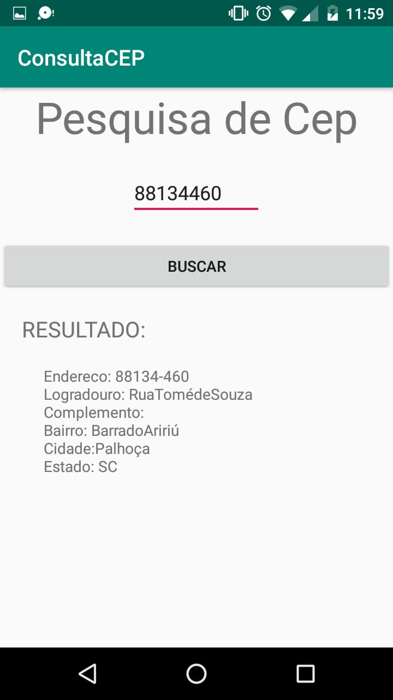

# Consulta-CEP
APP android que utiliza a API ViaCep para buscar o cep inserido pelo usuário e retornar o endereço.

  

# Tecnologias utilizadas
- Async Task - para fazer a requisição 
- Gson - para converter o retorno da requisição em objeto

# Como executar o APP

- Baixar o arquivo .apk chamado: app-debug.apk e executa-lo no celular.
